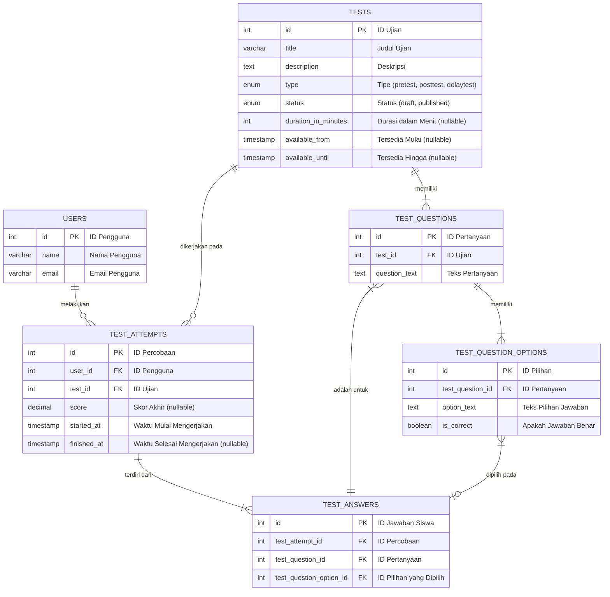

```mermaid
erDiagram
TESTS {
    int id PK "ID Ujian"
    varchar title "Judul Ujian"
    text description "Deskripsi"
    enum type "Tipe (pretest, posttest, delaytest)"
    enum status "Status (draft, published)"
    int duration_in_minutes "Durasi dalam Menit (nullable)"
    timestamp available_from "Tersedia Mulai (nullable)"
    timestamp available_until "Tersedia Hingga (nullable)"
}

TEST_QUESTIONS {
    int id PK "ID Pertanyaan"
    int test_id FK "ID Ujian"
    text question_text "Teks Pertanyaan"
}

TEST_QUESTION_OPTIONS {
    int id PK "ID Pilihan"
    int test_question_id FK "ID Pertanyaan"
    text option_text "Teks Pilihan Jawaban"
    boolean is_correct "Apakah Jawaban Benar"
}

USERS {
    int id PK "ID Pengguna"
    varchar name "Nama Pengguna"
    varchar email "Email Pengguna"
}

TEST_ATTEMPTS {
    int id PK "ID Percobaan"
    int user_id FK "ID Pengguna"
    int test_id FK "ID Ujian"
    decimal score "Skor Akhir (nullable)"
    timestamp started_at "Waktu Mulai Mengerjakan"
    timestamp finished_at "Waktu Selesai Mengerjakan (nullable)"
}

TEST_ANSWERS {
    int id PK "ID Jawaban Siswa"
    int test_attempt_id FK "ID Percobaan"
    int test_question_id FK "ID Pertanyaan"
    int test_question_option_id FK "ID Pilihan yang Dipilih"
}

TESTS ||--|{ TEST_QUESTIONS : "memiliki"
TEST_QUESTIONS ||--|{ TEST_QUESTION_OPTIONS : "memiliki"
USERS ||--o{ TEST_ATTEMPTS : "melakukan"
TESTS ||--o{ TEST_ATTEMPTS : "dikerjakan pada"
TEST_ATTEMPTS ||--|{ TEST_ANSWERS : "terdiri dari"
TEST_QUESTIONS }|--|| TEST_ANSWERS : "adalah untuk"
TEST_QUESTION_OPTIONS }|--o| TEST_ANSWERS : "dipilih pada"
```